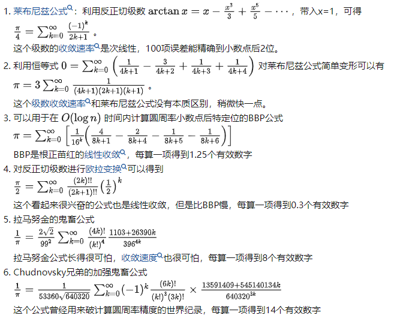

# C++求Pi

## 分析

参考[目前求 π 的算法中哪种收敛最快？ - 知乎 (zhihu.com)](https://www.zhihu.com/question/312520105)中@[byoshovel](https://www.zhihu.com/people/byoshovel)答主的回答，有这些比较容易想到的方法



对于我们的任务来说，拉马努金公式和加强鬼畜公式和BBP有区别吗？没区别

为了得到$n$位精度的$\pi$，我们需要计算$\Theta(n)$项子项，而高精度四则运算中最简单的加减法也需要$\Theta(n)$次运算，乘法和除法更甚，因此线性逼近算法的时间复杂度是$\Omega(n^2)$，最多只有常数级的改进（开根甚至更花时间）

因此我们需要寻找更快的算法

## 高斯-勒让德算法

高斯-勒让德通过迭代的方式，每一次迭代所得到的精度倍增，因此时间复杂度是$\Omega(nlogn)$，在$n\ge 1000000$的时候和线性逼近算法拉开的质的差距

### 算法内容

$$
a_0=1 \quad b_0={1 \over \sqrt 2} \quad t_0={1 \over 4} \quad p_0=1

$$

然后进行迭代

$$
a_{n+1}={\frac {a_n+b_n} 2} \quad b_{n+1}=\sqrt {a_nb_n} \quad t_{n+1}=t_n-p_n(a_n-a_{n+1})^2 \quad p_{n+1}=2*p_n

$$

最终可以求出

$$
\pi \approx {\frac {(a_{n+1}+b_{n+1})^2} {4t_{n+1}}}

$$

### 算法实现

首先我们可以用double来测试下思路

```cpp
std::tuple<double,double,double,double>
    init_iteration() {

    double a0=1, b0=1/sqrt(2), t0=1.0/4, p0=1;
    for (int i=0;i < 5;++i) {
        printf("%.14f %.14f %.14f --- ",a0,b0,t0);
        printf("%.16lf\n",square(a0+b0)/4/t0);
        double a,b,t,p;
        a = (a0+b0) / 2;
        b = sqrt(a0*b0);
        t = t0 - square(a0-a)*p0;
        p = 2*p0;
        a0=a,b0=b,t0=t,p0=p;
    }
    return {a0,b0,t0,p0};
}
```

> 输出结果

1.00000000000000 0.70710678118655 0.25000000000000 --- 2.9142135623730949
0.85355339059327 0.84089641525371 0.22855339059327 --- 3.1405792505221686
0.84722490292349 0.84720126674689 0.22847329108090 --- 3.1415926462135428
0.84721308483519 0.84721308475277 0.22847329052223 --- 3.1415926535897940
0.84721308479398 0.84721308479398 0.22847329052223 --- 3.1415926535897940

可以看到double精度的极限大概在15位小数左右

囿于排版，除法和开根的实现放在后面

### 进一步的算法分析

可以看到，在1w数量级时，90%以上的时间都在开根号，在n=10w时，50%的时间在开根号，因此开根算法的优化变得极为重要

#### sqrt优化

最初的开根笔者是用二分法实现的，二分法需要$O(n)$次查找，并且每次需要平方自身一次$O(n^2)$，总计$O(n^3)$

手动开根算法需要${\frac 1 2}n=O(n)$次，最后一项最长，n位与1位的乘法需要$E={\frac 1 2}n=O(n)$的时间，以及guess的$10n=O(n)$时间的比较，总计$O(n^2)$，系数约为$\frac {21} 4$。但是手动开根的缺点是只能算到输入一半的长度，所以要么保留乘法后的2倍长度大数，要么开一半长度后牛顿迭代。

牛顿迭代法需要$O(logn)$次的除法，除法需要求n位商，带缓存的竖式除法需要$O(n^2)$，总计$O(n^2logn)$，系数约为2

数量级在n=1w时，手动开根约为$5n^2$，牛顿法约为$13n^2$。n更大时手动开根可能更优

此外，迭代法的初值使用an，可以逐次减少迭代的次数

#### 进一步的优化

笔者的电脑用了45s跑到了1w位

而如果用python的decimal模块却只需要2s

```python
%%time
an = Decimal(1)
bn = Decimal(0.5).sqrt()
tn = Decimal(0.25)
pn = 1

def pi(an, bn, tn):
    s = an+bn
    return s*s / (tn*4)

ran = math.ceil(math.log(prec)) * 2
print(ran)
for i in tqdm.trange(ran):
    a = (an+bn) / 2
    b = (an*bn).sqrt()

    tn = tn - ((a-an)**2)*pn

    pn = pn*2
    an = a
    bn = b

    re = pi(an,bn,tn)
```

查看decimal的源码，发现其sqrt用的是改进版的牛顿迭代法，但运算次数还是在$O(logn)$。为什么还有这么大的差距？

进一步查阅资料后发现乘法可以用FFT优化到$O(nlogn)$，除法也可以类似地优化到$O(nlogn)$

此时牛顿迭代法开根号需要的时间减少为$O(nlog^2n)$

最终用python花了近半小时跑出了圆周率后100w位

### 除法和根号的实现

```cpp
FixedInteger FixedInteger::operator/(const FixedInteger &ano) const {
    if (val.size() != ano.val.size()) {
        throw std::runtime_error("FixedInt trying to divide 2 int with different size\n");
    }


    int len;
    std::array<FixedInteger,10> prod;
    {
        FixedInteger trunc(ano);
        len = trunc.valid_length() - 1;
        auto iter = trunc.val.begin() + len;
        trunc.val.erase(trunc.val.begin(),iter);
        prod.at(0).val.resize(trunc.size());
        prod.at(1) = std::move(trunc);
    }
    for (int i=2;i < 10;++i) {
        prod.at(i) = (prod.at(1) * i);
    }

    FixedInteger re(size());

    FixedInteger residual;
    int bias = prod.at(1).size();
    residual.val = std::vector<Digit>(val.begin(),val.begin()+bias);
    residual.val.reserve(residual.size() + ano.size());

    //决速步
    clock_t time = 0;
    for (int idx = 0;idx < ano.size();++idx) {
        if (1) { //特化版 速度没啥区别
            auto start = std::chrono::steady_clock::now();
            int factor = find_quotient(residual,idx,prod);

            re.val.at(idx) = factor;
            //主要在减法
            residual = std::move(subtract(residual, idx, prod.at(factor) ));
            auto end = std::chrono::steady_clock::now();
//            std:: cout << "divide sub time " << duration_cast<microseconds>(end-start).count() << '\n';

            Digit temp = idx+bias >= size() ? 0 : val.at(idx+bias);
            residual.val.emplace_back(temp);
        }
        else {
            auto start = std::chrono::steady_clock::now();
            int factor = find_quotient(residual,0,prod);

            re.val.at(idx) = factor;
            residual = residual - prod.at(factor);
            auto end = std::chrono::steady_clock::now();
            std:: cout << "divide sub time " << duration_cast<microseconds>(end-start).count() << '\n';

            Digit temp = idx+bias >= size() ? 0 : val.at(idx+bias);
            residual.val.emplace_back(temp);
            // 这里用错了erase begin
            residual.val.erase(residual.val.begin());
            end = std::chrono::steady_clock::now();
            std:: cout << "divide realloc time " << duration_cast<microseconds>(end-start).count() << '\n';
        }
    }

    return std::move(re);
}


FixedInteger FixedInteger::sqrt(std::optional<const FixedInteger *> ref) {
    FixedInteger guess;
    if (ref.has_value()) {
        guess = FixedInteger(*ref.value());
    }
    guess.val.resize(size());

    int prec = (val.size() - 2);

    int t=0;
    while (true) {
        auto start = clock();
//        FixedInteger &&fix = (*this) * divideOne(guess);
        FixedInteger &&fix = (*this) / guess;
//        std:: cout << "sqrt:: divide time " << (clock()-start) << '\n';
//        std::cout << guess.string() << '\n' << fix.string() << std::endl;

        int cnt=0;
        for (auto p=guess.val.cbegin(),pano=fix.val.cbegin();
             p != guess.val.cend() && pano != fix.val.cend();++p,++pano,++cnt) {
            if (*p != *pano) {
                break;
            }
        }
        if (cnt >= prec) break;

        guess = std::move((guess + fix).half());
        t++;
    }
    std::cout << t << std::endl;
    return std::move(guess);
}
```

## 总结

1.最外层循环

> 我们先从朴素的莱布尼兹级数开始，再到需要计算$O(n)$项的BBP公式线性逼近，最后到了只需$O(log_2n)$次迭代的高斯-勒让德算法（文初的链接中提到有$O(log_9n)$的算法）

2.四则运算

> 加减法的时间复杂度保持在$O(n)$，而乘法（如果不用FFT）仍然保持在$O(n^2)$。除法我们从最初的求倒数转乘法（$O(n^2)$+$O(n^2)$）到直接竖式除法（$O(n^2)$），再在竖式乘法中缓存除数0-9的值（减少$O(n^2)$的系数）。而乘除法还可以用FFT进一步优化到$O(nlogn)$

3.大数的存储结构

> 最初我们用deque实现了通用的大数四则运算，然而deque在加法和乘除法时都会涉及到malloc，此外deque的顺序访问需要访问指针，速度较慢。对于求pi这个问题，我们需要进行特定化。注意到an bn均在[0.7,1.0]范围内，而pn约等于目前求到的精度，一般会落在int范围，因此可以固定浮点的长度，利用vector的性质大幅加快加减运算，而乘除运算需要额外适配vector，因为除法运算时残差会不断补0，第一个有效数字前会有多余的0，vector在尾部操作是$O(1)$的，但在头部操作是$(O(n)$的

### bonus 为了加速开方而缓存上一次的开方结果

```cpp
// -----
// I/Os
// -----


std::string FixedInteger::string(unsigned trunc, bool drop_zero) const {
    std::stringstream ss;
    bool first0=drop_zero;
    int cnt = 0;
    for (int i = 0; i < size(); ++i) {
        Digit p = val.at(i);
        if (p == 0 && first0)
            continue;

        first0=false;
        ss << static_cast<int>(p);
        if (cnt++ >= trunc) break;
    }
    if (first0) ss << 0;
    return ss.str();
}

void FixedInteger::save_ckpt(std::string path) {
    std::ifstream is(path);
    int prev = 0;
    if (is >> prev) {
        if (prev > size()) {
            return;
        }
    }
    std::ofstream fs(path);
    fs << size() << '\n' << string(-1, false);
    fs.close();
}
bool FixedInteger::load_ckpt(std::string path, int prec) {
    std::string str;
    std::ifstream fs(path);
    int prev = 0;
    if (fs >> prev) {
        fs.ignore();
        fs >> str;
        setValue(str, prec);
        return true;
    }
    else {
        std::cerr << "File doesn't exist." << std::endl;
        return false;
    }

}
```
